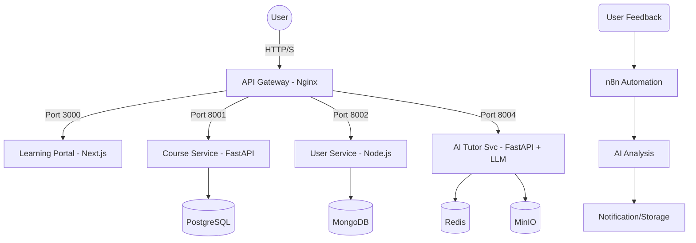

# E-learning Microservice Platform 🎓

A scalable, AI-powered e-learning platform built with a microservices architecture. This project integrates modern web technologies, AI assistance, and automated feedback workflows.

## 🏗️ Architecture

The platform follows a microservices architecture managed by Docker Compose, with an Nginx API Gateway routing requests to specialized services.



## 🚀 Key Features

- **AI Tutor:** Contextual Q&A based on course content, automated quiz generation, and personalized recommendations.
- **n8n Automation:** Automated feedback collection workflow with AI enrichment and notifications.
- **Analytics Dashboard:** Tracking enrollments, course completions, and learning trends.
- **Learning Portal:** Modern, responsive interface built with Next.js and shadcn/ui.

## 🛠️ Technology Stack

| Component | Technology |
| :--- | :--- |
| **Frontend** | Next.js, shadcn/ui, Tailwind CSS |
| **Backend Services** | FastAPI (Python), Express (Node.js) |
| **API Gateway** | Nginx |
| **Databases** | PostgreSQL, MongoDB |
| **Caching & Storage** | Redis, MinIO |
| **Automation** | n8n |
| **DevOps** | Docker, Docker Compose |

## 📦 Services Overview

| Service | Responsibility | Port |
| :--- | :--- | :--- |
| **learning-frontend** | Public portal (Next.js) | `3000` |
| **course-service** | Course & lesson management (FastAPI) | `8001` |
| **user-service** | Auth (JWT) & profile management (Node.js) | `8002` |
| **analytics-service** | Tracking & trends (FastAPI) | `8003` |
| **ai-tutor-service** | AI Q&A & quiz generation (FastAPI) | `8004` |
| **n8n-automation** | Feedback workflows | `5678` |
| **nginx-gateway** | Reverse proxy & security | `80/443` |

## 🛠️ Getting Started

### Prerequisites

- Docker and Docker Compose installed.
- Node.js & Python (for local development).

### Installation & Deployment

1. **Clone the repository:**
   ```bash
   git clone <repository-url>
   cd elearning-microservice-platform
   ```

2. **Configure Environment Variables:**
   Copy `.env.example` to `.env` and update the values.
   ```bash
   cp .env.example .env
   ```

3. **Launch the platform:**
   ```bash
   docker-compose up -d
   ```

4. **Access the services:**
   - **Frontend:** `http://localhost:3000`
   - **n8n Editor:** `http://localhost:5678`

## 📁 Project Structure

```text
elearning-microservice-platform/
├── backend/
│   ├── analytics-service/   # Tracking & Trends (FastAPI)
│   ├── course-service/      # Content Management (FastAPI)
│   ├── user-service/        # Identity Management (Node.js)
│   └── ai-tutor-service/    # AI Assistance (To be implemented)
├── frontend/                # Learning Portal (Next.js)
├── gateway/                 # Nginx Configuration
├── docker-compose.yml       # Production/Orchestration
└── README.md                # Project Documentation
```

## 🎓 Master DevOps & Cloud - 2026
This project is part of the integration project for the Master DevOps & Cloud program.
